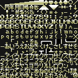

# Print string using a custom font

This ROM displays "Hello world!" using the `print_string` routine and a custom font.



First we need to convert the font into the native tile format. We'll use the `encode_gfx` tool.

The image for the custom font contains 256 tiles (16 by 16) mapping each ASCII character.
```json
{
	"tile": [
		{ "name": "font.bin", "x":0, "y":0, "w":16, "h":16 }
	],
    "palette": [
        { "name": "palette.bin", "start": 0, "count": 1 }
    ]
}
```

In order to prevent HuDK from using the system font, we will have to define some prepocessor variables before any HuDK include file.
Namely 
* `HUDK_USE_CUSTOM_FONT` in order to prevent HuDK from inclusing the default font.
* `FONT_8x8_COUNT`the number of characters in the font.
* `FONT_ASCII_FIRST` the ASCII code of the first character.
* `FONT_ASCII_LAST` the ASCII code of the last character.
* `FONT_DIGIT_INDEX` the index of the first digit (`0`). 
* `FONT_UPPER_CASE_INDEX` the index of the first upper case character (`A`). 
* `FONT_LOWER_CASE_INDEX` the index of the first lower case character (`a`). 

In our case we will have:
```asm
FONT_8x8_COUNT=$1ff
FONT_ASCII_FIRST=$00
FONT_ASCII_LAST =$9e
FONT_DIGIT_INDEX=$30
FONT_UPPER_CASE_INDEX=$41
FONT_LOWER_CASE_INDEX=$61
```
Next, we will have to copy the palette to the VCE using the `vce_load_palette` routine, and the tiles to VRAM using `vdc_load_data`.
```asm
    ; load font palette
    stb    #bank(palette_bin), <_bl
    stw    #palette_bin, <_si
    jsr    map_data
    cla
    ldy    #1
    jsr    vce_load_palette

    ; load font gfx
    stb    #bank(font_bin), <_bl
    stw    #font_bin, <_si
    stw    #(VDC_DEFAULT_TILE_ADDR), <_di
    stw    #4096, <_cx
    jsr    vdc_load_data
```

We then have to tell the print routines where the font is located in VRAM and which palette to use.
```asm
    ; set font VRAM address
    ldx    #.lobyte(VDC_DEFAULT_TILE_ADDR)
    lda    #.hibyte(VDC_DEFAULT_TILE_ADDR)
    jsr    font_set_addr

    ; set font palette
    lda    #$00
    jsr    font_set_pal
```

Now, any call to the print routines will use the newly defined custom font.


